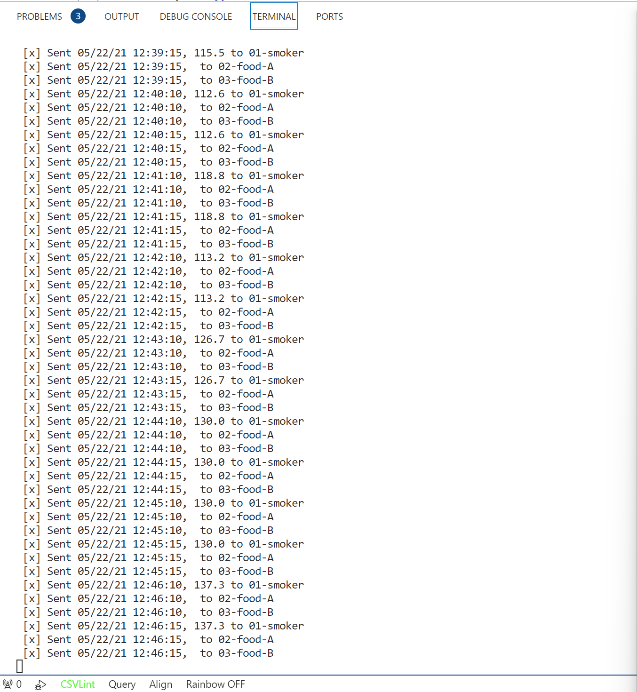
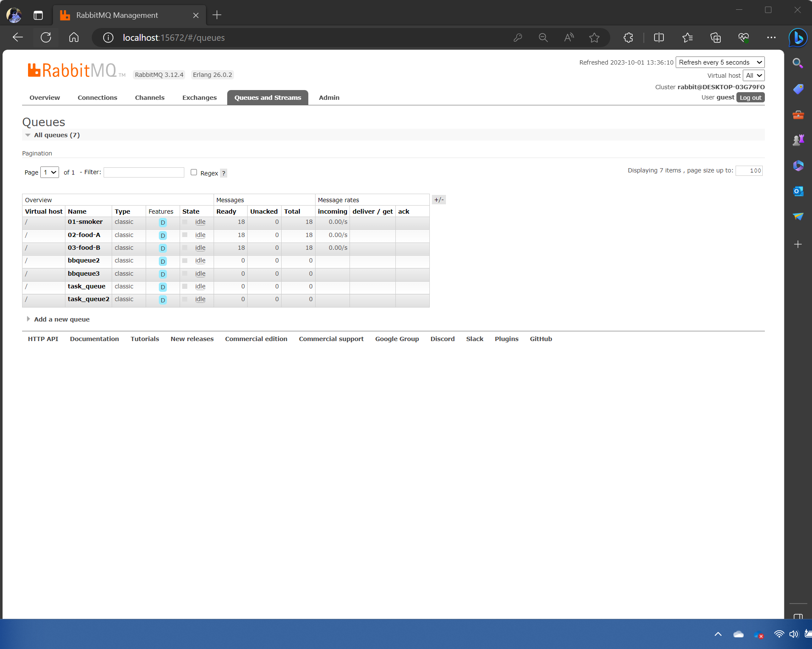

# streaming-05-smart-smoker

# this is intended to stream data via rabbit mq utilzing a csv named smoker-temps

   
    ###This program sends a message to a queue on the RabbitMQ server.
    Sends bbq information in segemeted time frames of 30 second intervals

    Author: Joshua Parton
    Date: September 22nd, 2023
## The Problem / Challenge To Solve
Please read about the Smart Smoker system here: Smart Smoker
Access the smoker data file here Download smoker data file here.
We want to stream information from a smart smoker. Read one value every half minute. (sleep_secs = 30)

smoker-temps.csv has 4 columns:

[0] Time = Date-time stamp for the sensor reading
[1] Channel1 = Smoker Temp --> send to message queue "01-smoker"
[2] Channel2 = Food A Temp --> send to message queue "02-food-A"
[3] Channel3 = Food B Temp --> send to message queue "03-food-B"
Requirements

RabbitMQ server running
pika installed in your active environment
RabbitMQ Admin

See http://localhost:15672/Links to an external site.
General Design Questions

How many producers processes do you need to read the temperatures:
How many queues do we use: 
How many listening callback functions do we need (Hint: one per queue): 
If that is all you need to get started, you can begin the project now. Apply everything you've learned previously. 

## Task 1. Create a Place to Work
In GitHub, create a new repo for your project - name it streaming-05-smart-smoker
Add a README.md during the creation process. (If not, you can always add it later.)
Clone your repo down to your machine. 
In VS Code, add a .gitignore (use one from an earlier module), start working on the README.md. Create it if you didn't earlier.
Add the csv data file to your repo. 
Create a file for your bbq producer.

## Task 2. Create a Place to Work
In GitHub, create a new repo for your project - name it streaming-05-smart-smoker
Add a README.md during the creation process. (If not, you can always add it later.)
Clone your repo down to your machine. 
In VS Code, add a .gitignore (use one from an earlier module), start working on the README.md. Create it if you didn't earlier.
Add the csv data file to your repo. 
Create a file for your bbq producer.

